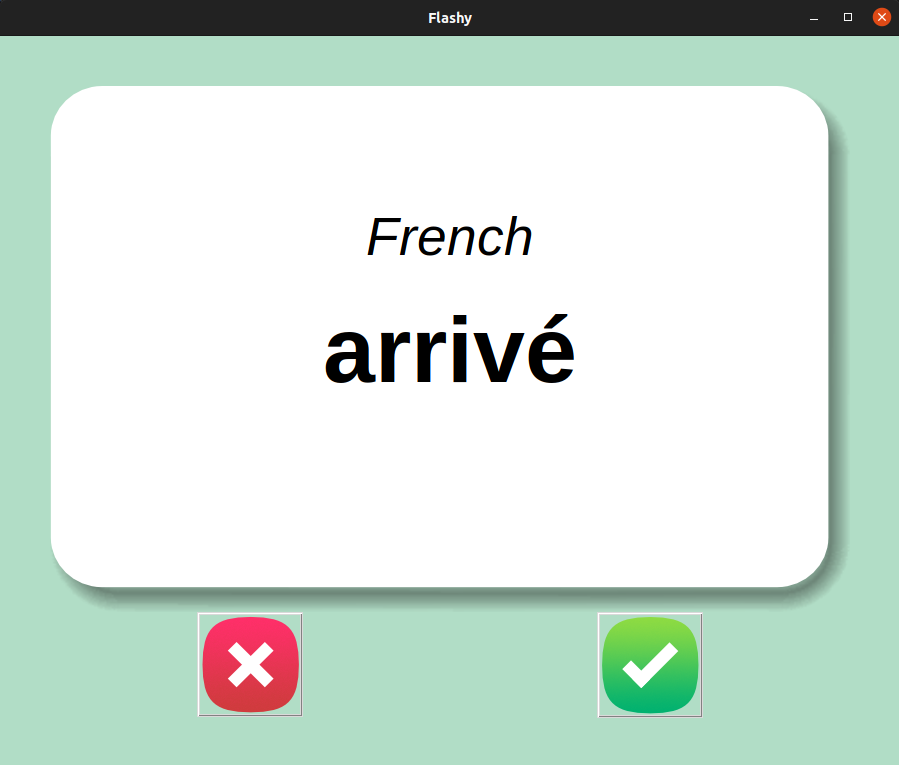

# FLIP FLASH CARD

Программа для зубрежки иностранных слов.

Слова отображаются в виде карточек. На лицевой стороне слово, а на обратной - перевод. Карточка автоматически переворачивается через 3 секунды.

Нажмите галочку, если знаете слово. В таком случае карточка удаляется из словаря и в дальнейшем не предлагается к повторению.

# Как запустить приложение

Клонировать репозиторий
    
    git clone git@github.com:avagners/flash_card_project.git
    cd api_final_yatube

Cоздать и активировать виртуальное окружение:

    python3 -m venv venv
    source venv/bin/activate

Установить зависимости из файла requirements.txt:

    python3 -m pip install --upgrade pip
    pip install -r requirements.txt
